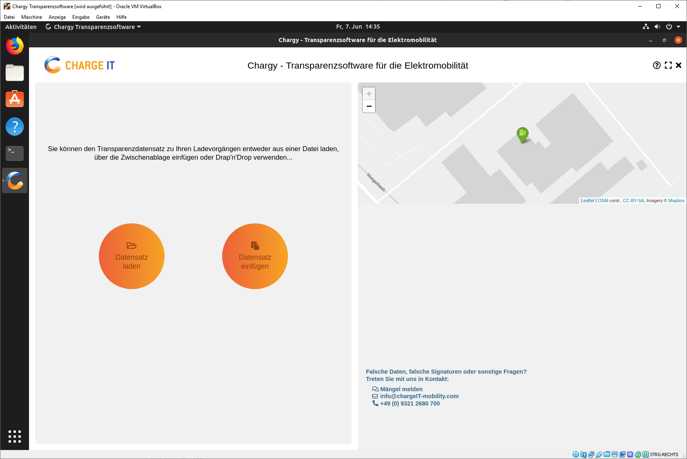

# Creating a Linux Live ISO Image

This documentation is based on the following HowTo ["How to customize the Ubuntu Live CD?"](https://askubuntu.com/questions/48535/how-to-customize-the-ubuntu-live-cd#) and the documentation of the [TRuDI Live CD](https://bitbucket.org/dzgtrudi/trudi-public/src/523dc990c741630342bdc5aeb93375373b11fb88/doc/linux-live-image.md?at=master), which is a similar project of the [Physikalisch-Technische Bundesanstalt](https://www.ptb.de) for the transparency of smart meters, but was updated to support newer versions of Ubuntu Linux.



### Preparing the Linux Live ISO Image

We use [Ubuntu 19.04 (amd64)](http://releases.ubuntu.com/19.04/ubuntu-19.04-desktop-amd64.iso) as the base for our ISO image. We expect this ChargyDesktopApp git repository located at *../ChargyDesktopApp*.

```
git clone https://github.com/OpenChargingCloud/ChargyDesktopApp.git
wget http://releases.ubuntu.com/19.04/ubuntu-19.04-desktop-amd64.iso

mkdir ChargyLive
cd ChargyLive

sudo modprobe loop
sudo modprobe iso9660
mkdir source
sudo mount -t iso9660 ../ubuntu-19.04-desktop-amd64.iso source -o ro,loop
mkdir ubuntu-livecd
cp -a source/. ubuntu-livecd
sudo chmod -R u+w ubuntu-livecd 
sudo umount source
rmdir source

mkdir old
sudo mount -t squashfs -o loop,ro ubuntu-livecd/casper/filesystem.squashfs old 

sudo dd if=/dev/zero of=ubuntu-fs.ext2 bs=1M count=7000
sudo mke2fs ubuntu-fs.ext2

mkdir new
sudo mount -o loop ubuntu-fs.ext2 new
sudo cp -va old/. new
sudo umount old
rmdir old

sudo cp /etc/resolv.conf new/etc/
sudo mount -t proc -o bind /proc new/proc
sudo mount -o bind /dev/pts new/dev/pts

sudo cp ../ChargyDesktopApp/dist/chargytransparenzsoftware_1.0.0_amd64.deb new/opt/
```

### Change root into the new Linux system and update all software packages

```
sudo chroot new /bin/bash 
apt update
apt upgrade -y

sed -i 's/restricted/restricted universe multiverse/g' /etc/apt/sources.list
apt update
apt upgrade -y

apt install -y joe mc
```

### Change system settings
```
echo "Europe/Berlin" > /etc/timezone
rm -f /etc/localtime
ln -sf /usr/share/zoneinfo/Europe/Berlin /etc/localtime
apt install -y language-pack-de language-pack-gnome-de wngerman wogerman wswiss
update-locale LANG=de_DE.UTF-8 LANGUAGE=de_DE LC_ALL=de_DE.UTF-8
sed -i 's/XKBLAYOUT=\"us\"/XKBLAYOUT=\"de\"/g' /etc/default/keyboard

mkdir /etc/skel/.config
echo "yes" >> /etc/skel/.config/gnome-initial-setup-done

### gsettings set org.gnome.desktop.background picture-uri "file:///home/username/path/to/image.jpg"
```

### Install Chargy Transparency Software
```
apt install -y /opt/chargytransparenzsoftware_1.0.0_amd64.deb

# If the Chargy application icon is broken, try the following work-around
sed -i 's/Icon=chargytransparenzsoftware/Icon=\/opt\/Chargy\ Transparenzsoftware\/build\/chargy_icon.png/g' /usr/share/applications/chargytransparenzsoftware.desktop 

mkdir /etc/skel/Desktop
cp /opt/Chargy\ Transparenzsoftware/documentation/chargeIT-Testdatensatz-01.json /etc/skel/Desktop/
cp /opt/Chargy\ Transparenzsoftware/documentation/chargy-Nutzerhandbuch.pdf /etc/skel/Desktop/

mkdir /etc/skel/.config/autostart
cp /usr/share/applications/chargytransparenzsoftware.desktop /etc/skel/.config/autostart/

echo -e "[org.gnome.shell]\nfavorite-apps=[ 'org.gnome.Nautilus.desktop', 'org.gnome.Software.desktop', 'yelp.desktop', 'org.gnome.Terminal.desktop', 'firefox.desktop', 'chargytransparenzsoftware.desktop' ]" > /usr/share/glib-2.0/schemas/90_gnome-shell.gschema.override
```

### Optional PTB Security Settings

The PTB (Paternalistische Technische Bundesanstalt) demands that the logged-in Linux user is not able to install and run malicious software. The following settings should limit the risks.    
*Disclaimer: We do not recommend these changes!*
```
# gsettings list-recursively org.gnome.software
echo -e "[org.gnome.software]\nallow-updates=false\ndownload-updates=false\ndownload-updates-notify=false" > /usr/share/glib-2.0/schemas/91_gnome-software.gschema.override

# gsettings list-recursively org.gnome.desktop.media-handling
echo -e "[org.gnome.desktop.media-handling}\nautorun-never=true" > /usr/share/glib-2.0/schemas/92_gnome-desktop-media-handling.gschema.override

adduser --disabled-password --gecos "" chargy
sed -i 's/#  AutomaticLogin = user1/AutomaticLogin = chargy/g' /etc/gdm3/custom.conf
```

### Remove legacy applications
```
apt purge -y libreoffice-common thunderbird aisleriot gnome-mahjongg gnome-mines gnome-sudoku libgnome-games-support-common
apt purge -y ubuntu-web-launchers gdb gdbserver gparted simple-scan sane-utils bolt bluez bluez-cups bluez-obexd transmission-common deja-dup cheese remmina remmina-common totem totem-common rhythmbox rhythmbox-data shotwell shotwell-common gnome-todo gnome-todo-common libgnome-todo
# Remove Ubuntu Installer
apt purge -y ubiquity ubiquity-casper ubiquity-slideshow-ubuntu ubiquity-ubuntu-artwork

??? gnome-initial-setup (because of cheese removal???)
```

### Do not do this!
```
apt autoremove
```

### Unmount everything, create file manifest and clear free space
```
exit
sudo umount new/proc
sudo umount new/dev/pts
sudo rm new/etc/resolv.conf

sudo chroot new dpkg-query -W --showformat='${Package} ${Version}\n' > ubuntu-livecd/casper/filesystem.manifest

sudo printf $(sudo du -sx --block-size=1 ubuntu-livecd/ | cut -f1) | sudo tee ubuntu-livecd/casper/filesystem.size
cd ubuntu-livecd
find -type f -print0 | sudo xargs -0 md5sum | grep -v isolinux/boot.cat | sudo tee md5sum.txt
cd ..

sudo dd if=/dev/zero of=new/dummyfile
sudo rm new/dummyfile
```

### Create new system image (will take a while)
```
sudo rm ubuntu-livecd/casper/filesystem.squashfs
cd new
sudo mksquashfs . ../ubuntu-livecd/casper/filesystem.squashfs -comp xz
cd ..
sudo umount new
rmdir new
```

### Create ISO image
```
sudo genisoimage \
    -o "Chargy Transparenzsoftware Live v1.0.0.iso" \
    -b isolinux/isolinux.bin \
    -c isolinux/boot.cat \
    -no-emul-boot \
    -boot-load-size 4 \
    -boot-info-table \
    -r \
    -V "Chargy Transparenzsoftware Live" \
    -cache-inodes  \
    -J \
    -l \
    ubuntu-livecd
```

OLD TRuDI HowTo... do not use!!!

## Hinweise für die Erstellung eines Live-USB Mediums

Damit das ISO-Image immer von der USB starten kann, erzeugen Sie ein _Hybrid_-Image daraus:

```
sudo apt install syslinux-utils
sudo isohybrid --uefi --verbose live.iso
```

Danach wird empfohlen, das Hybrid-Image auf das USB-Medium zu __klonen__. Dafür können Sie das Programm _mkusb_ direkt von ihrem Ubuntu Host-Rechner benutzen.
Sie können zwar Programme wie das _Unetbootin_ verwenden, um das Image auf das USB-Medium zu übertragen. Das _Unetbootin_ benötigt sogar das Hybrid-Image nicht, sondern Sie können ein normales ISO-Image auf das USB-Medium damit übertragen. Nachteil von diesen Programmen ist, dass Sie meistens einen eigenen Bootloader anlegen, und damit nicht weiter sichergestellt ist was in dem Absatz: **_Bootvorgang und Laden der rechtlich relevanten Software_** _(PTB-8.51-MB08-BSLM-DE-V01)_ gefordert wird.
